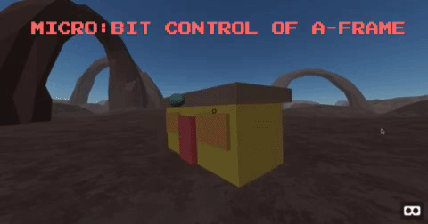
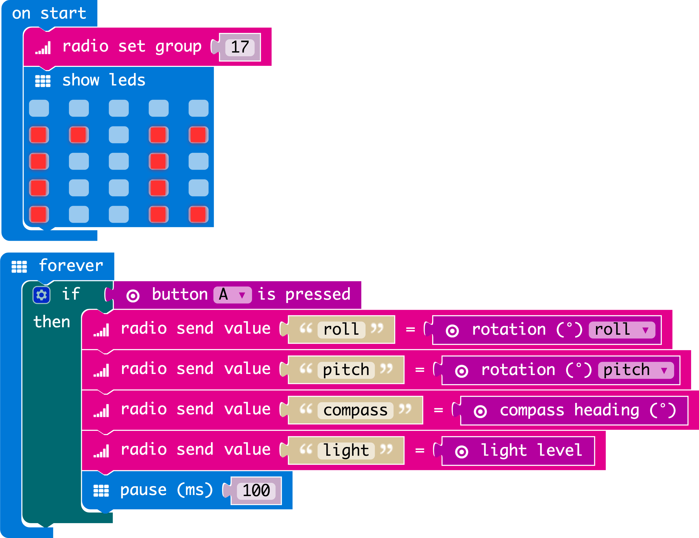
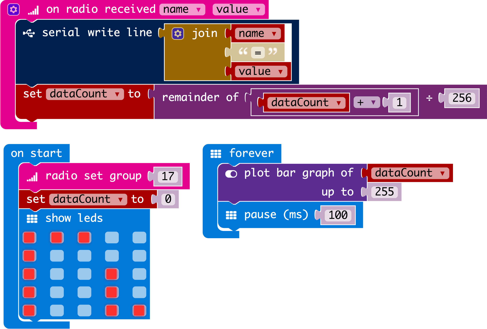
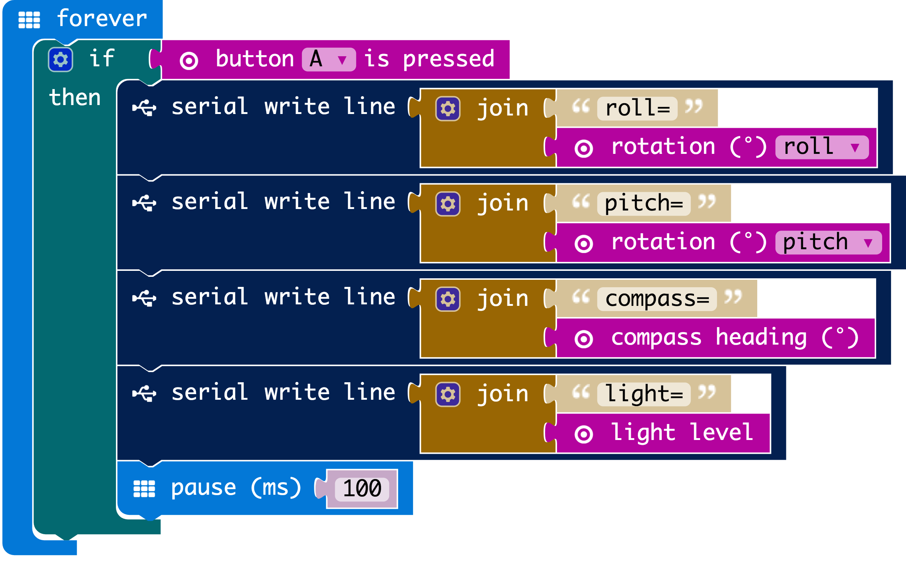

# Using BBC micro:bit(s) to control an A-Frame scene - Example

An example of controlling A-Frame object(s) from one or more BBC micro:bits.

Uses the p5.serialport library for p5.js and p5 Serial Control executable.



# Pre-requisites

* a computer running chrome or firefox, sufficiently up-to-date to run A-Frame, and with a usb port with which it will  talk to a micro:bit.
* [Shawn Van Every's p5 SerialControl executable][p5 serialcontrol link]
* two BBC micro:bits*
* one usb lead to connect a microbit to your computer (capable of data, not only power)
* a battery pack for the other of the microbits

*If you only have one micro:bit, a stand-alone "SerialControl" program has been included which still allows you to test, but this micro:bit will have to be plugged into your computer via USB.  You might want a longer, softer lead for it!

# Installation

1) If you trust it, install [Shawn Van Every's p5 SerialControl executable][p5 serialcontrol link].
2) Run the "p5 Serial Control" executable
3) Download this repo and unzip it if necessary
4) install [the microbit Radio-Controller][microbit-Radio-Controller hex link] onto your "Remote Control" micro:bit
5) install [the microbit Radio-To-Serial-Relay onto your "relay" micro:bit][microbit-Radio-to-Serial-Relay hex link]
6) Press button A on it for a second or two.  It will scroll "Draw a Circle" or otherwise prompt you to do compass calibration.  It will not do this again provided you do not re-flash the micro:bit.
7) power your "remote control" micro:bit with a battery pack.  It should show "rc"
8) plug in your "relay" micro:bit via usb.  It will quickly show "rl" (for "relay") but will almost immediately start showing a ticker of how many radio messages it has sent.
9) Test the two micro:bits by pressing and holding button A on the "remote control" micro:bit.  You should see the display gradually changing *on the other micro:bit* as it counts off the messages it has received and passed on to serial.
10) Edit your local copy of `sketch.js` to change the variable `serialPortName` to reflect the name of the "serial port" being used by your plugged-in micro:bit.  (You could alternatively use browser dev tools to edit this code in place if your aframe example is not local.)
You can see the available ports listed in the p5.SerialControl gui.  In my case, the port is something like `/dev/cu.usbmodem1412` so *my* code would look as follows:
```
// fill in the name of YOUR serial port here:
var serialPortName = "/dev/cu.usbmodem1412";
```
11) start a webserver to serve your local copy of the repo with the corrected serialPortName in `sketch.js` (or host it on github pages, or wherever) e.g. from the root dir of the repo: `python -m SimpleHTTPServer 8080`
12) visit index.html in your served copy and check the a-frame scene loads.  You should see an A-Frame world with a general environment, and a foreground object.
13) press button A on the "remote control" micro:bit, and move it around.  You should see the foreground object in your A-Frame rotate accordingly.  Note that for compass direction to work, you should hold the micro:bit with LED matrix facing upwards.
14) You're done!  Or rather, you're just getting started!  Fork this example repo and do something cool with it.


# Troubleshooting: 

* Ensure that the radio-to-serial-relay's display is changing while you press the remote control's button A.  If it's not, the relay isn't receiving any radio messages.  Consider range, and if you've changed the micro:bit programs, consider radio group, and radio message format (it should send a key-value pair, not a string)
* Check the browser console for error messages.
* ensure p5 SerialControl executable is running.
* ensure your micro:bit is being detected by the OS and offered as a "serial port".  One way is to check it is listed in p5 SerialControl executable's GUI.
* Try with the simpler stand-alone SerialControl micro:bit which reports *its own* sensor values directly via serial.
* If you loaded the web components before you edited the serialPortName variable in sketch.js, then clear the browser cache of these files and reload them.
* Follow the [micro:bit documentation for monitoring the serial communication from your micro:bit on your computer][microbit serial comms link].  For example, on OSX, `screen /dev/cu.usbmodem1412 115200`.  Guess what, again be careful to use the correct serial port name.  Be careful to end this `screen` session with Ctrl-A Ctrl-D.  Be aware that only one program can have the serial port open at any one time, so it can't be open simultaneously by both screen and  by the browser / p5-SerialControl combo.

# Usage

* Press button A on the remote control micro:bit to have it report its sensor readings to a-frame via the radio-to-serial relay micro:bit.
* Hold down button A while the remote control micro:bit is switching on to enable "always on" mode.  This will never stop sending sensor data.  This also works on the stand-alone SerialControl program.
* If the micro:bit says "Draw a circle", it is asking you to rotate it around until a circle is completed on its LED display, in order to calibrate its compass.  You will only have to do this once, unless you flash a different version of the code.
* Edit the remote control micro:bit program to send your *own* Custom data in key value pairs.  Change your copy of `sketch.js` to do something interesting with this data.    If you're going to change the sensing micro:bit's program often, you might want to remove compass heading from the sent sensor data (at least until you're finished most development), so that you don't have to "draw a circle" all the time!

# Expected serial communication protocol

The various components of this project are set to report and expect the relevant parameters one per line, in the following format: key=value  

For example:

```
compass=342
light=251
pitch=87
```

# micro:bit components

There are two approaches:

1) Use a duo of micro:bits, one acting as wireless controller, with the other acting as a relay, listening to the radio messages and passing them on over serial.
2) A simpler, single micro:bit controller which plugs directly in and reports its own sensor data directly over serial.

## Remote + Serial-Relay

This duo of programs allows one (or more) wireless micro:bit(s) to send their sensor data (such as orientation) via radio to another "relay" micro:bit which is plugged into the computer.  To save battery and allow the firehose to be stopped, it currently only transmits these messages when button "a" is pressed.  

The _relay's_ job is to listen for these radio messages and to pass them on immediately as serial communications, with the correct text protocol*.

Note: These components must of course set an identical radio group before communicating.  This example uses group 17.

### Part 1: The radio controller



[Open the Radio-Controller project on makecode][makecode Radio-Controller link]


### Part 2: The radio-to-serial relay




[Open the Radio-to-Serial-Relay project on makecode][makecode Radio-to-Serial-Relay link]


## A one-microbit alternative: Serial-Controller

This alternative micro:bit program sends sensor data from a connected micro:bit using serial (whenever button a is pressed).  It is useful for simpler testing, if you only have one micro-bit, or don't need radio control of a-frame.



[Open the stand-alone serial-controller project on makecode][makecode serial-controller link]


# TODO

* auto-detect the serial port, as far as possible.  This would allow plug-and-play.  On os-x, if there's only one `/dev/cu.usbmodem*` then go for that one.
* Allow the user to choose the serial port from a GUI.
* Allow the user to pass in the serial port as an argument to the page request.
* Have the relay note the UID of the rc micro:bit and include this in the serial message.  This will allow  multiple remote control micro:bits to send sensor information allowing these feeds to be considered distinctly on arrival to the a-frame / js component.
* add an option to smooth out the accelerometer values so that it is less shaky.

[makecode Radio-Controller link]: https://makecode.microbit.org/_fTuVA3ePuAs4

[makecode Radio-to-Serial-Relay link]: https://makecode.microbit.org/_KbdMiq7jof3X

[makecode serial-controller link]: https://makecode.microbit.org/_dAEJCJEYyV4y

[microbit-Radio-Controller hex link]: microbit_components/hexes/microbit-Radio-Controller.hex

[microbit-Radio-to-Serial-Relay hex link]: microbit_components/hexes/microbit-Radio-to-Serial-Relay.hex

[microbit-Serial-Controller hex link]: microbit_components/hexes/microbit-Serial-Controller.hex

[p5 serialcontrol link]: https://github.com/vanevery/p5.serialcontrol/releases

[microbit serial comms link]: https://www.microbit.co.uk/td/serial-library

[house anim example gif on giphy]: https://giphy.com/gifs/3o6fITs5oKqIrERSQo
